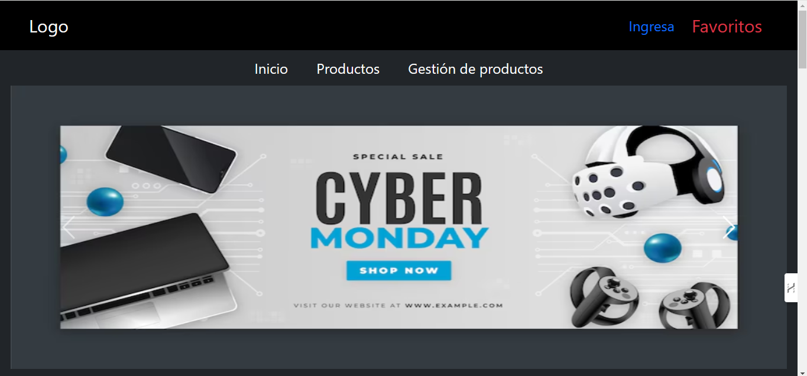
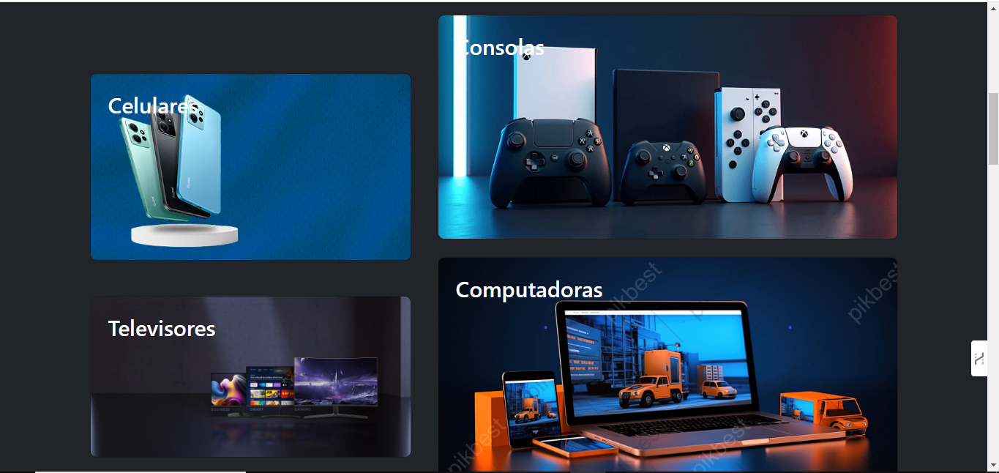
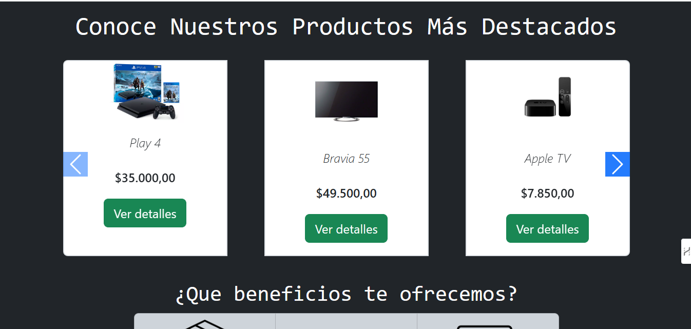
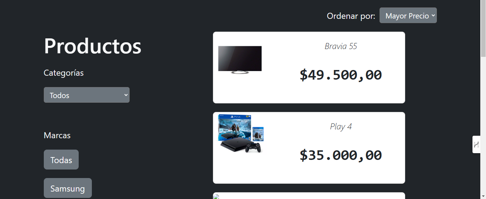
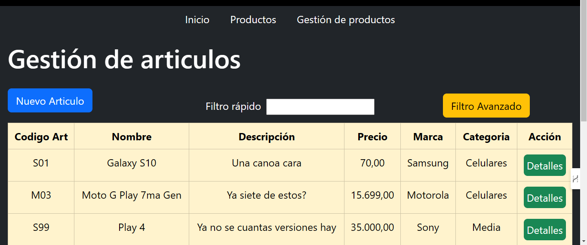
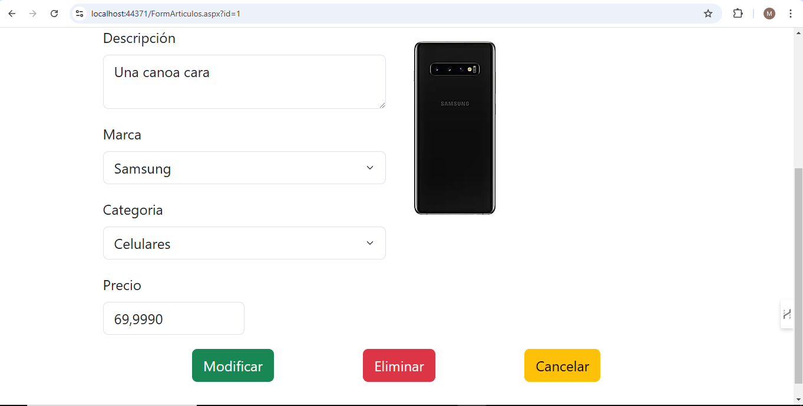

# Trabajo Práctico Final

Este es un proyecto de sitio web para la venta de artículos, principalmente de tecnología. El sistema cuenta con un inicio de sesión que divide a los usuarios en dos roles: administrador y usuario normal. Los administradores pueden gestionar los productos mediante un CRUD, mientras que los usuarios normales pueden visualizar los productos disponibles.

## Características

* Autenticación de usuarios: Inicio de sesión con roles (Admin / Usuario Normal).

* Administración de productos: Los administradores pueden agregar, modificar y eliminar productos.

* Visualización de catálogo: Los usuarios normales pueden ver los artículos disponibles para la venta.

* Diseño responsivo: Adaptado para distintos dispositivos.

## Tecnologías Utilizadas

* Frontend: HTML, Bootstrap  

* Backend: .NET Framework

* Base de datos: Sql Server

 📸 
 ## Capturas de Pantalla

  
  
  
  
  
  

